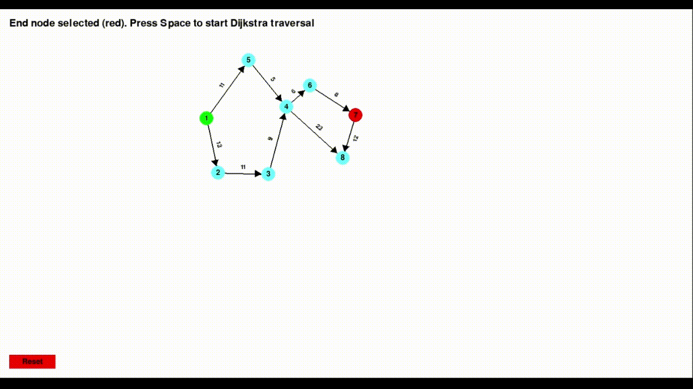

# 🧠 Node-Based Graph Traversal Visualizer (Pygame)

An **interactive graph traversal visualizer** built with Python and Pygame. This tool allows users to create custom graphs and visualize how various traversal and pathfinding algorithms work in real time.

---

## ✨ Features

- ✅ **Interactive Node and Edge Creation**
- ♻️ **Directed / Undirected Graph Toggle**
- ⚖️ **Weighted / Unweighted Graph Support**
- 👀 **Live Visualization of Traversals**
- 🧱 **Algorithms Supported:**
  - Depth First Search (DFS)
  - Breadth First Search (BFS)
  - Dijkstra’s Shortest Path
  - A* (A-Star) Algorithm
- 📐 **Option to Choose Manhattan or Euclidean Heuristic for A\***
- ⌚ **Traversal Time Displayed in Microseconds**
- 🎥 **Current and Peak memory of traversal is shown in KB's**
- 📜 **On-Screen Instructions for Smooth User Experience**
- ↺ **Reset Feature to Clear Graph and Start Fresh**

---

## 🖼️ Preview



---

## 🕹️ How to Use

### ⚖️ 1. Start the Program

```bash
python visualizer.py
```

### 🪄 2. Add Nodes

- **Left Click** on the screen to place nodes.
- Press Enter to confirm the node setup
### ➡️ 3. Choose directed or undirected graph
- Press **D** for directed graph
- Press **U** for undirected graph
- Press **Enter** to confirm
### ⚖️ 4. Choose weighted or unweighted graph
- Press **W** for weighted graph
- Press **U** for unweighted graph
- Press **Enter** to confirm
### 🔗 5. Add Edges

- After selecting the graph type and weight mode:
- **Click two nodes** to connect them with an edge.
- If **weights** are enabled, you’ll be prompted to enter edge weight, type the required weight and press **Enter** to move to the next edge
- If **directed**, edges will have arrowheads indicating direction.
- Press **Enter** to finish edge creation

### 📍 5. Choose Algorithm

- Press `D` → Start **DFS** traversal
- Press `B` → Start **BFS** traversal
- Press `J` → Start **Dijkstra’s** algorithm
- Press `A` → Start **A\*** algorithm
### 🛤️ Heuristic seelction for A*
- If **A\*** is selected 
- Press **E** to use **Euclidean distance** 
- Press **M** to use **Manhatten distance**
### 🗿 6. Traversal Guide

- **Right-click** on a node to set it as the starting node.
- For **Dijkstra** and **A\***, you'll also be prompted to enter the destination node.
- **Execution** time will be shown in microseconds upon completion.
- **Time taken** will be displayed after traversal completion
### ↺ 7. Reset

- Press `Reset` button on the pygame window to **clear all nodes and edges** and start a new graph.

---

## 🧠 How It Works

This visualizer creates an internal graph representation using dictionaries and adjacency lists. Nodes are tracked with their positions, and edges maintain weights (if enabled). Traversal algorithms animate step-by-step progression, coloring visited nodes and paths.

### Algorithms

| Algorithm   | Purpose                      | Uses Edge Weights | Guarantees Shortest Path |
|-------------|------------------------------|-------------------|---------------------------|
| DFS         | Graph traversal (deep first) | ❌                | ❌                        |
| BFS         | Graph traversal (breadth)    | ❌                | ✅ (in unweighted graphs) |
| Dijkstra    | Shortest path                | ✅                | ✅                        |
| A*          | Optimized shortest path      | ✅                | ✅ (when weights are not extreme outliers)                  |

---

## 📊 Sample Performance Comparison (Manual Test)

|   Algorithm	  |   Time Taken | Path Length |	Memory Usage |
|---------------|--------------|-------------|---------------|
|   Dijkstra	  |	   4700 μs	 |     14      |     3300 KB    |
| A* (Euclidean)|	   2800 μs	 |     14      |     2600 KB    |
| A* (Manhattan)|	   3200 μs	 |     14      |     2900 KB    |
- ✅ Observation: A* (Euclidean) was ~40% faster than Dijkstra, with the same optimal path and lower memory usage.


---
## 🎨 Visual Legend

| Color         | Meaning                             |
|---------------|-------------------------------------|
| 🟦 Blue       | Unvisited node                      |
| 🟩 Green      | Visited node                        |
| 🟨 Yellow     | Current node being explored         |
| 🔴 Red        | Final path from source to target    |
| ⚫ Black line | Edge (directional if enabled)       |

---

## 🧰 Tech Stack

- **Language:** Python 3
- **Library:** [Pygame](https://www.pygame.org/)  
- **Visualization:** Custom drawing via Pygame surfaces and primitives

---

## 📌 Future Improvements

- Node and edge deletion
- Drag to reposition nodes
- Edge weight editing
- Multiple traversal animations side-by-side
- Save/load graph configurations
- Support for advanced algorithms like Floyd-Warshall and Bellman-Ford (for handling negative weights)

---


